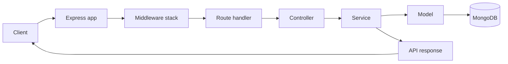

# Backend API

## Project Overview

This backend powers a university-facing form and survey platform. It uses a modular monolith structure with a controller-service-model pattern, which keeps each domain focused without adding unnecessary framework overhead.

The API supports dynamic form creation, survey submission, academic data management, file uploads, and role-based access control. Swagger is available for interactive API exploration, and Winston handles runtime logging.

## Tech Stack

| Layer | Technology |
| --- | --- |
| Runtime | Node.js |
| Web Framework | Express |
| Database | MongoDB |
| ODM | Mongoose |
| Authentication | JWT |
| API Docs | Swagger UI |
| Logging | Winston |
| File Uploads | Multer |
| Hardening | CORS, rate limiting, XSS and sniffing protection |

## Project Structure

```text
backend/
├── config/               # App, logger, CORS, rate-limit, and message setup
├── helpers/              # Bootstrap, initialization, utilities, mail helpers
├── middleware/           # Auth, validation, upload, and shared middleware
├── public/               # Static assets and uploaded files
├── server/
│   ├── Project/
│   │   ├── Auth/
│   │   ├── Form/
│   │   ├── Questions/
│   │   ├── Response/
│   │   ├── Organizations/
│   │   ├── Settings/
│   │   └── User/
│   ├── router/
│   └── swagger/
├── swagger/              # Swagger UI bootstrap
├── views/                # EJS views used by the app
├── seed.js               # Development seed script
└── server.js             # Application entry point
```

## Setup & Run Instructions

### Prerequisites

- Node.js 18 or newer
- MongoDB reachable from the backend
- npm

### Install and start

```bash
npm install
npm start
```

For local development with a dedicated environment file:

```bash
npm run serve:dev
```

To seed development data:

```bash
npm run serve:seed
```

### `.env` example

```env
NODE_ENV=development
PORT=8081
BASE_SERVER_URL=http://localhost:8081

MONGODB=mongodb://127.0.0.1:27017/university
MONGODB_DB=university

JWT_SECRET=change-me-in-development

KEY=your-app-key
TIMEOUT=10000
TOKENLENGTH=32
TOKENEXPIRED=7
TRANSACTIONEXPIRED=1

ALLOWED_FILE_EXTENSIONS=.jpg,.jpeg,.png,.gif,.pdf,.doc,.docx,.txt
MAX_FILE_SIZE_MB=3
```

After startup, the main entry points are:

- Swagger UI: `http://localhost:8081/api-docs`
- Readiness probe: `http://localhost:8081/healthz`
- API health check: `http://localhost:8081/api/v1/health`

## Architecture Overview

The request flow is intentionally simple:



Request processing follows this path:

1. Express boots the application and loads middleware.
2. Middleware applies security, logging, validation, compression, and request parsing.
3. Routes map requests to feature modules.
4. Controllers coordinate input and output.
5. Services contain business logic and database access.
6. Mongoose models persist data in MongoDB.

## Core Modules

- Form: Owns form lifecycle, visibility rules, scheduling, and form-level settings.
- Question: Manages dynamic questions, answer types, validation, and file or image metadata.
- Response: Stores submitted answers and keeps form and user references in sync.
- User: Handles users, roles, and organization linkage for access control.
- Organizations: Stores academic or business units used in visibility rules.
- Settings: Stores supporting lookup collections such as status, control types, response modes, messages, and verification state.
- Auth: Issues and validates JWT-based sessions for login flows.

## API Design

The API is versioned under `/api/v1` and returns JSON consistently. Swagger documents the available endpoints and is the best place to inspect request and response shapes.

### Response format

```json
{
  "code": 20000,
  "httpcode": 200,
  "message": ["Success"],
  "data": {},
  "status": "success",
  "statusCode": 200,
  "timestamp": "2026-04-08T00:00:00.000Z",
  "url": "/api/v1/form"
}
```

### API standards

- Use nouns for resource routes where possible.
- Keep request and response payloads JSON-first.
- Use the `/api/v1` prefix for public application routes.
- Prefer Swagger definitions for contract clarity.
- Return consistent HTTP status codes alongside the wrapped response body.

## Database

The backend uses MongoDB collections that map directly to the Mongoose models.

| Collection | Purpose |
| --- | --- |
| `Forms` | Main form documents, visibility rules, collaborators, and submission references |
| `Questions` | Question definitions and per-question configuration |
| `Responses` | Submitted response payloads and answer mappings |
| `Users` | User records, organization links, roles, and response references |
| `Roles` | Role catalog used for RBAC |
| `Organizations` | Academic or business organization records |
| `Setting_Status` | Form status lookup values |
| `Setting_Controll` | Collaborator/control lookup values |
| `Setting_Group` | Group lookup values |
| `Setting_Messages` | Shared message templates |
| `Setting_Respond` | Response-related settings |
| `Setting_Verification` | Verification states |
| `Question_Types` | Question type catalog |

## Security

- JWT-based session handling is used for authentication.
- Role-based access control is supported through role and organization data.
- File uploads are validated by extension and MIME type.
- Upload size is capped through middleware configuration.
- Express hardening is enabled with CORS, rate limiting, no-cache, no-sniff, and XSS protection middleware.
- Sensitive user fields such as passwords are removed from JSON output by the user model.

## Performance & Scalability

- Modular separation keeps feature code isolated and easier to scale.
- MongoDB querying is used directly through Mongoose for efficient persistence.
- Upload paths are generated per form and response context to keep stored files organized.
- Compression is enabled to reduce response payload size.
- Health endpoints make it easier to monitor readiness and database status in containerized or hosted environments.

## Operations

### Health checks

- `GET /healthz` returns `200 OK` when the app is ready and `503` while it is still warming up.
- `GET /api/v1/health` reports app uptime, memory usage, and MongoDB connection state.

### Logging

- Winston is used for request logging through shared middleware.
- Logs are structured and easier to trace in development and deployment environments.
- The logger is wired into the Express middleware stack before route handling.

### Dockerized usage

The backend is environment-driven, so it can run cleanly inside Docker or any other container platform as long as the same `.env` values are provided. At minimum, expose the configured `PORT` and make sure `MONGODB` and `JWT_SECRET` are available in the container runtime.

## Recent Updates

- Form visibility now respects public, organization, allowed-user, collaborator, and admin access rules.
- Form list fetching was updated to pass user, organization, and admin context for backend-side filtering.
- File upload handling was tightened with extension checks, MIME validation, and context-aware upload directories.
- Health and logging paths were standardized for easier operational debugging.

## Known Limitations

- Some auth routes are present in the codebase but are not mounted by default in the main router.
- File uploads are stored on disk rather than in external object storage.
- Several collection and field names are legacy-compatible, so they are intentionally not renamed.
- The backend expects MongoDB and environment variables to be configured before startup.

## Contributors

- Sai Shang Hlang - core backend implementation, form visibility updates, and project maintenance.
- Add additional contributors here as the project grows.
