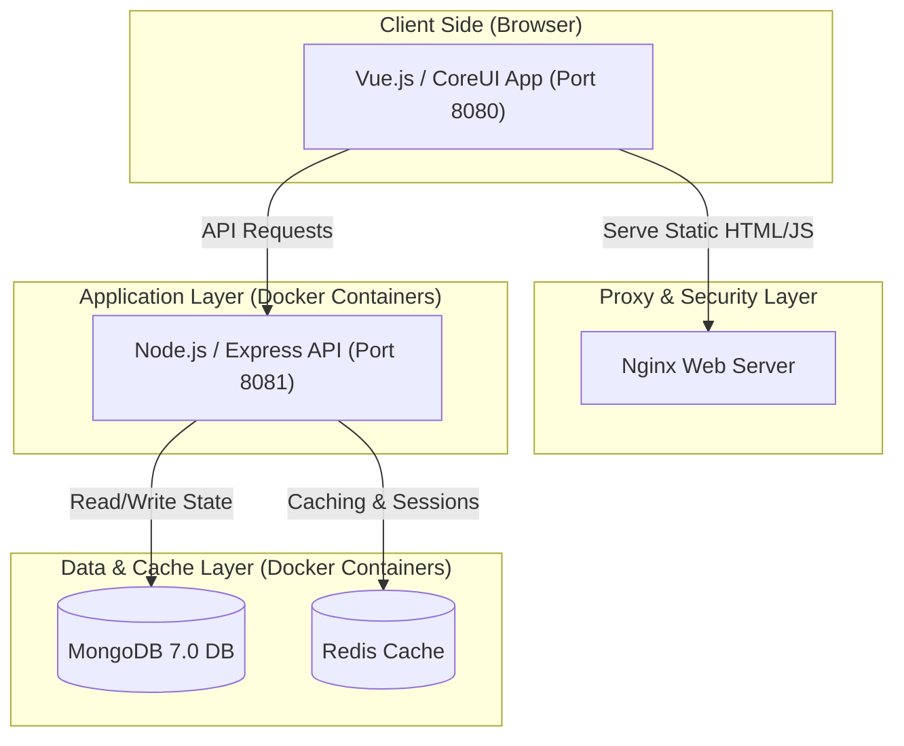

# 🎓 Digital University E-Questionnaires Platform

Welcome to the **Digital University E-Questionnaires Platform**, a robust, secure, and fully containerized full-stack web application designed for academic and corporate survey administration. 

This platform empowers administrative staff and teachers to create multilingual dynamic forms, track completions, analyze live response trends, manage system-wide configuration metadata, and enforce academic organization visibility rules.

---

## 🏛️ System Architecture Overview

The platform is designed around a decoupled **Full-Stack Containerized Architecture**, separating static high-performance client delivery from secure backend micro-services:



### 1. Frontend Client (`/frontend`)
* Built with **Vue.js** utilizing the premium **CoreUI Pro Bootstrap Admin Template**.
* Implements a secure **User Switcher** helper to test different academic roles (e.g., student, evaluator, supervisor, admin).
* Provides dynamic visual charts (via ChartJS) for instant survey response analytics.
* Securely communicates with the backend API via modular **Axios** clients utilizing tokenized headers.

### 2. Backend API Services (`/backend`)
* Built using **Node.js** and **Express** with a structured **Controller-Service-Model Pattern**.
* Version-routed under `/api/v1` for robust contract clarity.
* Integrates **Mongoose ODM** for MongoDB schemas with dynamic file upload handling using **Multer**.
* Offers an interactive **OpenAPI 3.0 (Swagger)** dashboard to explore and execute raw endpoints.
* Operational liveness checks (`/healthz`) and advanced telemetry (`/api/v1/health`) provide continuous state reports.

---

## 🚀 Quick Start (Local Docker Compose)

To start the entire full-stack application locally with a single command, ensure you have **Docker Desktop** installed and running on your machine:

### 1. Start all services:
Navigate to the root directory and build/run the containers:
```bash
# Start backend, db, and redis
cd backend && docker-compose up -d --build

# In a separate terminal tab, start the frontend
cd ../frontend && docker-compose up -d --build
```

### 2. Seed development data:
Execute the database seeder inside the running backend container to load default organizations, roles, users, questions, forms, and responses:
```bash
docker exec -it equestionaire-app npm run seed
```

### 3. Open applications in your browser:
* **Frontend Web App**: [http://localhost:8080](http://localhost:8080)
* **Backend API Docs (Swagger)**: [http://localhost:8081/api-docs](http://localhost:8081/api-docs)
* **API Telemetry Liveness**: [http://localhost:8081/api/v1/health](http://localhost:8081/api/v1/health)

---

## 🌐 🛠️ Step-by-Step Ubuntu Server Production Setup & Docker Deployment

This guide outlines the production deployment of the platform onto a clean **Ubuntu Server** (20.04 LTS or 22.04 LTS) using **Docker Compose**, backed by an **Nginx Reverse Proxy** with automatically renewing **Let's Encrypt SSL Certificates**.

### Step 1: Server Hardening & Preparation
1. Log in to your Ubuntu Server via SSH:
   ```bash
   ssh username@YOUR_SERVER_IP
   ```
2. Update the package index and upgrade existing server packages:
   ```bash
   sudo apt update && sudo apt upgrade -y
   ```
3. Setup a basic firewall using **UFW** to secure open ports:
   ```bash
   # Allow SSH
   sudo ufw allow OpenSSH
   
   # Allow Web traffic
   sudo ufw allow proto tcp from any to any port 80,443
   
   # Enable Firewall
   sudo ufw enable
   ```

### Step 2: Install Docker Engine & Docker Compose
1. Remove any outdated Docker versions:
   ```bash
   sudo apt remove docker docker-engine docker.io containerd runc
   ```
2. Set up the Docker repository:
   ```bash
   sudo apt install -y ca-certificates curl gnupg lsb-release
   sudo mkdir -p /etc/apt/keyrings
   curl -fsSL https://download.docker.com/linux/ubuntu/gpg | sudo gpg --dearmor -o /etc/apt/keyrings/docker.gpg
   echo \
     "deb [arch=$(dpkg --print-architecture) signed-by=/etc/apt/keyrings/docker.gpg] https://download.docker.com/linux/ubuntu \
     $(lsb_release -cs) stable" | sudo tee /etc/apt/sources.list.d/docker.list > /dev/null
   ```
3. Install Docker Engine and the Docker Compose plugin:
   ```bash
   sudo apt update
   sudo apt install -y docker-ce docker-ce-cli containerd.io docker-compose-plugin
   ```
4. Verify the installations are successful:
   ```bash
   docker --version
   docker compose version
   ```

### Step 3: Clone the Repository & Environment Setup
1. Clone the project code to your deployment directory (e.g., `/var/www/`):
   ```bash
   sudo mkdir -p /var/www/
   sudo chown -R $USER:$USER /var/www/
   cd /var/www/
   git clone https://github.com/Napus-BackendDev/Digital-University-Project-SE.git
   cd Digital-University-Project-SE
   ```

2. Create the production environment variables:
   * **Backend Environment** (`/var/www/Digital-University-Project-SE/backend/.env`):
     ```env
     NODE_ENV=production
     PORT=8081
     BASE_SERVER_URL=https://yourdomain.com
     
     # Use MongoDB service name defined in docker-compose.yml
     MONGODB=mongodb://equestionaire-db:27017/university
     MONGODB_DB=university
     
     # Choose a highly secure secret key
     JWT_SECRET=SUPER_SECRET_PRODUCTION_KEY_DO_NOT_SHARE
     ```
   * **Frontend Environment** (`/var/www/Digital-University-Project-SE/frontend/.env`):
     ```env
     VUE_APP_TITLE=MFU E-Questionnaires
     VUE_APP_API_BASE_URL=https://yourdomain.com/api/v1/
     VUE_APP_VERSION=1.0.0
     # Disable the user switcher dropdown in production for public security
     VUE_APP_ENABLE_USER_SWITCHER=false
     ```

### Step 4: Build and Launch Production Docker Containers
1. Navigate to the backend directory and launch the core services:
   ```bash
   cd /var/www/Digital-University-Project-SE/backend
   docker compose up -d --build
   ```
2. Navigate to the frontend directory and launch the client web service:
   ```bash
   cd /var/www/Digital-University-Project-SE/frontend
   docker compose up -d --build
   ```
3. Check that all four containers are healthy and running:
   ```bash
   docker ps
   ```

### Step 5: Perform Initial Seed
Since the production MongoDB volume starts empty, run the seeder once inside the backend container to populate required academic schemas:
```bash
docker exec -it equestionaire-app npm run seed
```

### Step 6: Configure Nginx as a Secure Reverse Proxy
1. Install Nginx on the Ubuntu host:
   ```bash
   sudo apt install -y nginx
   ```
2. Disable the default site configuration:
   ```bash
   sudo rm /etc/nginx/sites-enabled/default
   ```
3. Create a custom server block configuration for the application:
   ```bash
   sudo nano /etc/nginx/sites-available/equestionnaire.conf
   ```
4. Paste the following configuration, replacing `yourdomain.com` with your actual domain:
   ```nginx
   server {
       listen 80;
       server_name yourdomain.com;

       # 1. Forward all API Requests to the Backend API container
       location /api/v1/ {
           proxy_pass http://127.0.0.1:8081/api/v1/;
           proxy_http_version 1.1;
           proxy_set_header Upgrade $http_upgrade;
           proxy_set_header Connection 'upgrade';
           proxy_set_header Host $host;
           proxy_cache_bypass $http_upgrade;
           proxy_set_header X-Real-IP $remote_addr;
           proxy_set_header X-Forwarded-For $proxy_add_x_forwarded_for;
       }

       # 2. Forward Swagger Docs API Explorer
       location /api-docs {
           proxy_pass http://127.0.0.1:8081/api-docs;
           proxy_set_header Host $host;
       }

       # 3. Forward operational readiness check
       location /healthz {
           proxy_pass http://127.0.0.1:8081/healthz;
           proxy_set_header Host $host;
       }

       # 4. Forward all other traffic to Frontend client Nginx container
       location / {
           proxy_pass http://127.0.0.1:8080/;
           proxy_http_version 1.1;
           proxy_set_header Upgrade $http_upgrade;
           proxy_set_header Connection 'upgrade';
           proxy_set_header Host $host;
           proxy_cache_bypass $http_upgrade;
           proxy_set_header X-Real-IP $remote_addr;
           proxy_set_header X-Forwarded-For $proxy_add_x_forwarded_for;
       }
   }
   ```
5. Enable the configuration and restart Nginx:
   ```bash
   sudo ln -s /etc/nginx/sites-available/equestionnaire.conf /etc/nginx/sites-enabled/
   sudo nginx -t
   sudo systemctl restart nginx
   ```

### Step 7: Secure the Domain with Let's Encrypt SSL Certificates
1. Install Certbot and its Nginx plugin:
   ```bash
   sudo apt install -y certbot python3-certbot-nginx
   ```
2. Request and install an SSL certificate:
   ```bash
   sudo certbot --nginx -d yourdomain.com
   ```
   *Follow the interactive prompt to agree to Let's Encrypt terms and redirect all HTTP traffic automatically to HTTPS.*
3. Verify the certificate renews automatically:
   ```bash
   sudo certbot renew --dry-run
   ```

### Step 8: Configure Automated Daily Database Backups
1. Create a secure directory to hold database backups on the host machine:
   ```bash
   mkdir -p ~/backups/mongodb
   ```
2. Write a backup cron script:
   ```bash
   nano ~/backup-db.sh
   ```
3. Paste the following shell command to take an automated database snapshot:
   ```bash
   #!/bin/bash
   BACKUP_NAME="db-backup-$(date +%F-%H%M)"
   docker exec equestionaire-db mongodump --db=university --out=/data/db/$BACKUP_NAME
   # Move backup folder out of container volume to host backups dir
   mv /var/lib/docker/volumes/backend_equestionaire-db/_data/$BACKUP_NAME ~/backups/mongodb/
   echo "Backup saved: $BACKUP_NAME"
   ```
4. Make the script executable and add it as a daily cron job:
   ```bash
   chmod +x ~/backup-db.sh
   (crontab -l 2>/dev/null; echo "0 2 * * * /home/$USER/backup-db.sh") | crontab -
   ```

Your platform is now fully deployed, secured via HTTPS, and ready for high-performance usage!
