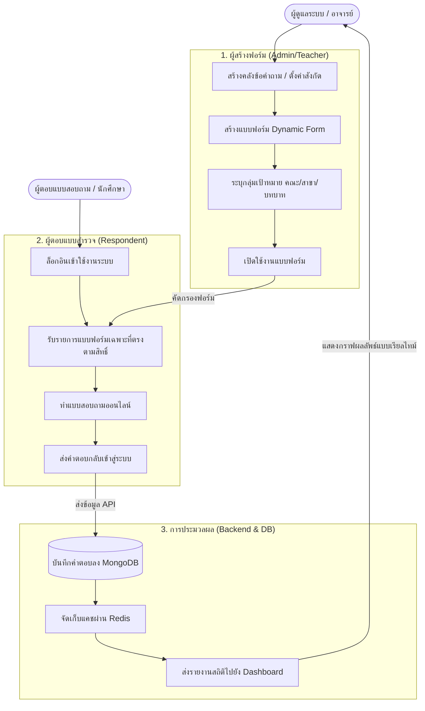

# 🎓 Digital University E-Questionnaires Platform

ระบบจัดการแบบสอบถามและแบบสำรวจออนไลน์ระดับองค์กร (E-Questionnaire) ที่มีความยืดหยุ่น ปลอดภัย และใช้งานง่าย

---

## 📝 คำอธิบายระบบ (Description)
**Digital University E-Questionnaires Platform** เป็นแพลตฟอร์มแบบ Full-Stack ที่ช่วยสถาบันการศึกษาและองค์กรต่างๆ จัดทำแบบสอบถามออนไลน์ได้อย่างมีประสิทธิภาพ ออกแบบมาด้วยสถาปัตยกรรมแบบแยกส่วน (Decoupled Architecture) และรันระบบผ่านเทคโนโลยีคอนเทนเนอร์ (Docker Container) ทำให้ติดตั้งได้รวดเร็ว ปลอดภัย และทนทานต่อการขยายตัวในอนาคต

---

## 💻 เทคโนโลยีที่ใช้ (Tech Stacks)
- **Frontend:** Vue.js, CoreUI Pro (Bootstrap Template), ChartJS, Axios
- **Backend:** Node.js, Express, Mongoose ODM, Swagger (OpenAPI 3.0), Multer
- **Database & Cache:** MongoDB 7.0, Redis Cache
- **DevOps & Proxy:** Docker, Docker Compose, Nginx

---

## 🛠️ ฟีเจอร์หลัก (Features)
- **Dynamic & Multilingual Forms:** สร้างแบบฟอร์มคำถามได้อย่างยืดหยุ่น รองรับการแปลหลายภาษา
- **Role-based Access Control:** แสดงผลแบบสอบถามตามบทบาทของผู้ใช้ (เช่น นักศึกษา, อาจารย์, ผู้ประเมิน) และข้อมูลสังกัด (คณะ/สาขาวิชา)
- **Real-time Analytics:** รายงานข้อมูลสถิติและแนวโน้มการตอบคำถามในรูปแบบกราฟแบบเรียลไทม์
- **Developer Helpers:** มาพร้อมระบบสลับสิทธิ์จำลอง (User Switcher) สำหรับการทดสอบ และ Swagger UI สำหรับจำลองการส่งข้อมูลผ่าน API

---

## 🔄 ขั้นตอนการทำงาน (System & User Flow)



---

## 🚀 การติดตั้งใช้งาน (Installation)

### สิ่งที่ต้องเตรียม (Prerequisites)
- **Docker Desktop** (ติดตั้งและเปิดใช้งานอยู่เบื้องหลัง)
- **Git**

### ขั้นตอนการรันระบบด่วน (Quick Start)
1. **โคลนซอร์สโค้ดจาก Git:**
   ```bash
   git clone https://github.com/Napus-BackendDev/Digital-University-Project-SE.git
   cd Digital-University-Project-SE
   ```
2. **รันระบบส่วนหลังบ้าน (Backend):**
   ```bash
   cd backend
   docker-compose up -d --build
   ```
3. **รันระบบส่วนหน้าบ้าน (Frontend):**
   *(เปิดหน้าต่าง Terminal/PowerShell แท็บใหม่)*
   ```bash
   cd ../frontend
   docker-compose up -d --build
   ```
4. **สร้างข้อมูลตัวอย่างสำหรับการทดสอบ (Seed Data):**
   ```bash
   docker exec -it equestionaire-app npm run seed
   ```

---

## 🎮 การใช้งาน (Usage)

เมื่อเปิดรันบริการทั้งหมดสำเร็จแล้ว สามารถทดสอบใช้งานผ่านช่องทางต่าง ๆ ดังนี้:

- **Frontend Web UI:** [http://localhost:8080](http://localhost:8080) *(สามารถกดสลับสิทธิ์ของผู้ทดสอบได้ที่หัวมุมบนขวา)*
- **API Documentation (Swagger UI):** [http://localhost:8081/api-docs](http://localhost:8081/api-docs)
- **สถานะระบบหลังบ้าน (Health Status):** [http://localhost:8081/api/v1/health](http://localhost:8081/api/v1/health)
