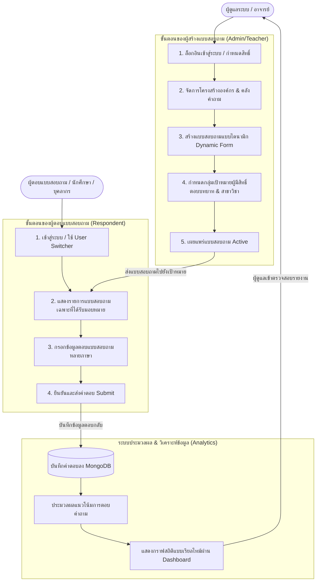

# 🎓 Digital University E-Questionnaires Platform

## 📌 โปรแกรมนี้คืออะไร?
**Digital University E-Questionnaires Platform** คือแพลตฟอร์มเว็บแอปพลิเคชันแบบ Full-Stack ที่ออกแบบมาสำหรับการจัดการแบบสอบถามและแบบสำรวจออนไลน์ ทั้งสำหรับสถาบันการศึกษาและองค์กรต่างๆ ตัวระบบถูกพัฒนาขึ้นในรูปแบบ Containerized (Docker) เพื่อให้ง่ายต่อการติดตั้งและใช้งานในทุกสภาพแวดล้อม

## 🎯 ใช้ทำอะไร?
แพลตฟอร์มนี้ช่วยให้ผู้ดูแลระบบ (Admin) และบุคลากร (เช่น อาจารย์):
- **สร้างแบบสอบถามแบบไดนามิก** ที่รองรับหลายภาษา
- **ติดตามสถานะการตอบกลับ** ได้แบบเรียลไทม์
- **วิเคราะห์ข้อมูล** แนวโน้มการตอบแบบสอบถามผ่านกราฟ (Visual Analytics)
- **จัดการสิทธิ์การเข้าถึง** ตามโครงสร้างภายในองค์กรหรือมหาวิทยาลัย (เช่น นักศึกษา, ผู้ประเมิน, ผู้ดูแลระบบ)

## ✨ ทำไมถึงน่าสนใจ?
- **ใช้งานง่ายและตอบสนองไว**: ส่วนหน้าบ้าน (Frontend) พัฒนาด้วย **Vue.js** และใช้เทมเพลตระดับพรีเมียม (CoreUI Pro) ทำให้ UI ทันสมัยและน่าใช้งาน
- **สถาปัตยกรรมที่ยืดหยุ่น**: แยกส่วนการทำงาน Frontend และ Backend อย่างชัดเจนผ่าน RESTful API (Node.js/Express) พร้อมระบบ Caching (Redis) เพื่อประสิทธิภาพสูงสุด
- **พร้อมสำหรับการขยายตัว (Scalability)**: ใช้ฐานข้อมูล **MongoDB** และมี Nginx เป็น Reverse Proxy
- **เครื่องมือช่วยเหลือสำหรับนักพัฒนา**: มี User Switcher สำหรับจำลองสิทธิ์การใช้งานต่างๆ อย่างรวดเร็ว (ไม่ต้องคอยล็อกเอาต์-ล็อกอินใหม่ซ้ำๆ) และมีระบบ Swagger สำหรับทดสอบ API ได้โดยตรง

---

## 🔄 ขั้นตอนการทำงานของระบบ (User Flow)

ระบบประกอบด้วยขั้นตอนการทำงานหลักของ 3 ส่วนคือ ผู้ดูแลระบบ/อาจารย์ (ผู้สร้างแบบฟอร์ม), ผู้ใช้งาน/นักศึกษา (ผู้ตอบแบบสอบถาม), และระบบหลังบ้านในการประมวลผลวิเคราะห์ข้อมูล ดังแผนภาพจำลองด้านล่างนี้:



### 1. ฝั่งผู้สร้างแบบสอบถาม (Admin & Teacher Flow)
* **การจัดการทรัพยากร**: ผู้ดูแลตั้งค่ากลุ่มข้อมูลองค์กร เช่น คณะ หรือ สาขาวิชา จากนั้นสร้างคลังข้อคำถาม (Questions Pool) เอาไว้
* **การสร้างฟอร์ม**: ดึงข้อคำถามจากคลังมาประกอบเข้าด้วยกันในเมนูสร้างแบบฟอร์ม (Form Builder) รองรับการตั้งค่าคำถามแบบหลายภาษา
* **การกระจายสิทธิ์**: กำหนดว่าฟอร์มนี้สงวนสิทธิ์ให้เฉพาะกลุ่มบทบาท (Roles) ใด หรือคณะ/สาขาไหนเป็นผู้ตอบ จากนั้นกดยืนยันเผยแพร่ฟอร์ม

### 2. ฝั่งผู้ทำแบบประเมิน (User & Respondent Flow)
* **การคัดกรองสิทธิ์**: เมื่อผู้ใช้เข้าสู่ระบบ ระบบจะกรองสิทธิ์ตาม Role และสังกัดวิชาการโดยอัตโนมัติ เพื่อแสดงเฉพาะแบบสอบถามที่เกี่ยวข้องกับตัวผู้ใช้งานจริงเท่านั้น
* **การตอบและส่ง**: ผู้ใช้งานกรอกฟอร์มตามภาษาที่ถนัด และกดยืนยันการส่ง (Submit)

### 3. ฝั่งประมวลผลและวิเคราะห์ (System Processing Flow)
* **การเก็บข้อมูล & แคช**: คำตอบทั้งหมดจะบันทึกลง MongoDB และใช้ Redis แคชสำหรับข้อมูลที่เรียกดูบ่อยครั้ง
* **การแสดงผลสถิติ**: ข้อมูลดิบจะถูกประมวลผลแบบเรียลไทม์และพล็อตออกมาเป็นกราฟ ChartJS บนแดชบอร์ด ให้ผู้ดูแลหรืออาจารย์เจ้าของวิชาเข้ามาวิเคราะห์ผลลัพธ์ได้ทันที

---

## 🚀 เริ่มใช้อย่างไร? (How to get started)

ระบบนี้ออกแบบให้ทำงานผ่าน Docker ทำให้การตั้งค่าเริ่มต้นนั้นง่ายมาก 

### สิ่งที่ต้องมีก่อน (Prerequisites)
- ติดตั้ง **Docker Desktop** (พร้อมให้โปรแกรมทำงานอยู่เบื้องหลัง)
- ติดตั้ง **Git**

### 💻 คู่มือสำหรับระบบปฏิบัติการ Windows
1. เปิด Command Prompt หรือ PowerShell และดาวน์โหลดโค้ด:
   ```cmd
   git clone https://github.com/Napus-BackendDev/Digital-University-Project-SE.git
   cd Digital-University-Project-SE
   ```
2. รัน Backend, Database และ Redis:
   ```cmd
   cd backend
   docker-compose up -d --build
   ```
3. รัน Frontend (เปิดหน้าต่าง Terminal/PowerShell แท็บใหม่):
   ```cmd
   cd ../frontend
   docker-compose up -d --build
   ```

### 🍎 คู่มือสำหรับระบบปฏิบัติการ macOS
1. เปิด Terminal และดาวน์โหลดโค้ด:
   ```bash
   git clone https://github.com/Napus-BackendDev/Digital-University-Project-SE.git
   cd Digital-University-Project-SE
   ```
2. รัน Backend, Database และ Redis:
   ```bash
   cd backend
   docker-compose up -d --build
   ```
3. รัน Frontend (เปิด Terminal แท็บใหม่):
   ```bash
   cd ../frontend
   docker-compose up -d --build
   ```
*(หมายเหตุ: หากใช้ macOS ชิปตระกูล Apple Silicon (M1/M2/M3) ระบบ Docker จะจัดการกระบวนการสร้าง (Build) ให้รองรับสถาปัตยกรรม ARM โดยอัตโนมัติตามที่มีการตั้งค่าไว้แล้ว)*

### 🛠️ การสร้างข้อมูลจำลองเริ่มต้น (Seed Data)
เมื่อคอนเทนเนอร์ทั้งหมดทำงานสำเร็จแล้ว ให้ใช้คำสั่งนี้เพื่อสร้างข้อมูลจำลองตั้งต้นเข้าสู่ฐานข้อมูล (เช่น ผู้ใช้งานจำลอง, ฟอร์มตัวอย่าง):

**สำหรับทั้ง Windows และ macOS ให้ใช้คำสั่ง:**
```bash
docker exec -it equestionaire-app npm run seed
```

### 🔗 ลิงก์สำหรับการเข้าใช้งาน
- **แอปพลิเคชันหน้าบ้าน (Frontend Web App)**: [http://localhost:8080](http://localhost:8080)
- **เอกสารอ้างอิง API (Backend Swagger)**: [http://localhost:8081/api-docs](http://localhost:8081/api-docs)
- **สถานะการทำงานของ API (Health Check)**: [http://localhost:8081/api/v1/health](http://localhost:8081/api/v1/health)

---

## 🌐 🛠️ คู่มือการตั้งค่าและการ Deploy บนเซิร์ฟเวอร์การผลิต (Production)

แพลตฟอร์มนี้รันด้วย **Docker** จึงสามารถนำไป Deploy ได้บนหลากหลายระบบปฏิบัติการ คำแนะนำนี้ครอบคลุมการตั้งค่าสำหรับ **Ubuntu Server (แนะนำ)**, **Windows Server**, และ **macOS**

---

### 🐧 ทางเลือกที่ 1: การ Deploy บน Ubuntu Server (แนะนำสำหรับ Production)
*ใช้ร่วมกับ Nginx Reverse Proxy และ Let's Encrypt SSL แบบต่ออายุอัตโนมัติ*

### ขั้นตอนที่ 1: การเตรียมความพร้อมและความปลอดภัยของเซิร์ฟเวอร์
1. เข้าสู่ระบบ Ubuntu Server ของคุณผ่าน SSH:
   ```bash
   ssh username@YOUR_SERVER_IP
   ```
2. อัปเดตแพ็กเกจของระบบให้เป็นเวอร์ชันล่าสุด:
   ```bash
   sudo apt update && sudo apt upgrade -y
   ```
3. ตั้งค่า Firewall พื้นฐานด้วย **UFW** เพื่อเปิดเฉพาะพอร์ตที่จำเป็น:
   ```bash
   # อนุญาตการเชื่อมต่อ SSH
   sudo ufw allow OpenSSH
   
   # อนุญาตการรับส่งข้อมูลเว็บ
   sudo ufw allow proto tcp from any to any port 80,443
   
   # เปิดใช้งาน Firewall
   sudo ufw enable
   ```

### ขั้นตอนที่ 2: ติดตั้ง Docker Engine และ Docker Compose
1. ลบ Docker เวอร์ชันเก่าที่อาจตกค้าง:
   ```bash
   sudo apt remove docker docker-engine docker.io containerd runc
   ```
2. ตั้งค่า Repository ของ Docker:
   ```bash
   sudo apt install -y ca-certificates curl gnupg lsb-release
   sudo mkdir -p /etc/apt/keyrings
   curl -fsSL https://download.docker.com/linux/ubuntu/gpg | sudo gpg --dearmor -o /etc/apt/keyrings/docker.gpg
   echo \
     "deb [arch=$(dpkg --print-architecture) signed-by=/etc/apt/keyrings/docker.gpg] https://download.docker.com/linux/ubuntu \
     $(lsb_release -cs) stable" | sudo tee /etc/apt/sources.list.d/docker.list > /dev/null
   ```
3. ติดตั้งโปรแกรม Docker Engine และ Docker Compose:
   ```bash
   sudo apt update
   sudo apt install -y docker-ce docker-ce-cli containerd.io docker-compose-plugin
   ```
4. ตรวจสอบว่าติดตั้งสำเร็จแล้ว:
   ```bash
   docker --version
   docker compose version
   ```

### ขั้นตอนที่ 3: โคลนโค้ดโปรเจกต์และตั้งค่า Environment
1. โคลนโค้ดไปยังไดเรกทอรีสำหรับระบบการผลิต (เช่น `/var/www/`):
   ```bash
   sudo mkdir -p /var/www/
   sudo chown -R $USER:$USER /var/www/
   cd /var/www/
   git clone https://github.com/Napus-BackendDev/Digital-University-Project-SE.git
   cd Digital-University-Project-SE
   ```
2. สร้างไฟล์ตัวแปรสภาพแวดล้อม (Environment Variables) สำหรับ Production:
   * **ฝั่ง Backend** (สร้างไฟล์ `/var/www/Digital-University-Project-SE/backend/.env`):
     ```env
     NODE_ENV=production
     PORT=8081
     BASE_SERVER_URL=https://yourdomain.com
     
     # ใช้ชื่อบริการ MongoDB ตามที่กำหนดไว้ใน docker-compose.yml
     MONGODB=mongodb://equestionaire-db:27017/university
     MONGODB_DB=university
     
     # กำหนดคีย์ความลับสำหรับ Production (ห้ามเปิดเผย)
     JWT_SECRET=SUPER_SECRET_PRODUCTION_KEY_DO_NOT_SHARE
     ```
   * **ฝั่ง Frontend** (สร้างไฟล์ `/var/www/Digital-University-Project-SE/frontend/.env`):
     ```env
     VUE_APP_TITLE=MFU E-Questionnaires
     VUE_APP_API_BASE_URL=https://yourdomain.com/api/v1/
     VUE_APP_VERSION=1.0.0
     # ปิดการใช้งานปุ่มสลับผู้ใช้จำลองในระบบ Production เพื่อความปลอดภัย
     VUE_APP_ENABLE_USER_SWITCHER=false
     ```

### ขั้นตอนที่ 4: สร้างและรัน Docker Containers สำหรับการผลิต
1. ไปที่โฟลเดอร์ backend และเริ่มการทำงานของบริการหลัก:
   ```bash
   cd /var/www/Digital-University-Project-SE/backend
   docker compose up -d --build
   ```
2. ไปที่โฟลเดอร์ frontend และเริ่มบริการเว็บไซต์หน้าบ้าน:
   ```bash
   cd /var/www/Digital-University-Project-SE/frontend
   docker compose up -d --build
   ```
3. ตรวจสอบว่าคอนเทนเนอร์ทั้ง 4 ทำงานอย่างปกติ (Healthy):
   ```bash
   docker ps
   ```

### ขั้นตอนที่ 5: สร้างข้อมูลตั้งต้นในฐานข้อมูล (Initial Seed)
เนื่องจากโฟลเดอร์ข้อมูลบนระบบการผลิตจะว่างเปล่าในตอนเริ่มต้น ให้รันคำสั่ง Seed หนึ่งครั้งภายในคอนเทนเนอร์ Backend:
```bash
docker exec -it equestionaire-app npm run seed
```

### ขั้นตอนที่ 6: ตั้งค่า Nginx สำหรับ Reverse Proxy แบบปลอดภัย
1. ติดตั้ง Nginx บนเซิร์ฟเวอร์ Ubuntu:
   ```bash
   sudo apt install -y nginx
   ```
2. ลบการตั้งค่าเว็บไซต์เริ่มต้นของ Nginx ออก:
   ```bash
   sudo rm /etc/nginx/sites-enabled/default
   ```
3. สร้างไฟล์การตั้งค่า Server Block สำหรับแอปพลิเคชัน:
   ```bash
   sudo nano /etc/nginx/sites-available/equestionnaire.conf
   ```
4. คัดลอกการตั้งค่าด้านล่างนี้ลงไป (อย่าลืมเปลี่ยน `yourdomain.com` เป็นโดเมนจริงของคุณ):
   ```nginx
   server {
       listen 80;
       server_name yourdomain.com;

       # 1. ส่งต่อคำขอ API ไปยังคอนเทนเนอร์ Backend API
       location /api/v1/ {
           proxy_pass http://127.0.0.1:8081/api/v1/;
           proxy_http_version 1.1;
           proxy_set_header Upgrade $http_upgrade;
           proxy_set_header Connection 'upgrade';
           proxy_set_header Host $host;
           proxy_cache_bypass $http_upgrade;
           proxy_set_header X-Real-IP $remote_addr;
           proxy_set_header X-Forwarded-For $proxy_add_x_forwarded_for;
       }

       # 2. ส่งต่อคำขอไปยังเอกสาร Swagger API
       location /api-docs {
           proxy_pass http://127.0.0.1:8081/api-docs;
           proxy_set_header Host $host;
       }

       # 3. ส่งต่อคำขอตรวจสอบสถานะระบบ
       location /healthz {
           proxy_pass http://127.0.0.1:8081/healthz;
           proxy_set_header Host $host;
       }

       # 4. ส่งต่อการรับส่งข้อมูลทั้งหมดที่เหลือไปยังคอนเทนเนอร์ Frontend
       location / {
           proxy_pass http://127.0.0.1:8080/;
           proxy_http_version 1.1;
           proxy_set_header Upgrade $http_upgrade;
           proxy_set_header Connection 'upgrade';
           proxy_set_header Host $host;
           proxy_cache_bypass $http_upgrade;
           proxy_set_header X-Real-IP $remote_addr;
           proxy_set_header X-Forwarded-For $proxy_add_x_forwarded_for;
       }
   }
   ```
5. เปิดใช้งานการตั้งค่าและรีสตาร์ท Nginx:
   ```bash
   sudo ln -s /etc/nginx/sites-available/equestionnaire.conf /etc/nginx/sites-enabled/
   sudo nginx -t
   sudo systemctl restart nginx
   ```

### ขั้นตอนที่ 7: รักษาความปลอดภัยของโดเมนด้วย Let's Encrypt SSL
1. ติดตั้ง Certbot และปลั๊กอินสำหรับ Nginx:
   ```bash
   sudo apt install -y certbot python3-certbot-nginx
   ```
2. ร้องขอและติดตั้งใบรับรอง SSL:
   ```bash
   sudo certbot --nginx -d yourdomain.com
   ```
   *ทำตามคำแนะนำบนหน้าจอเพื่อยอมรับข้อตกลง และระบบจะทำการ Redirect HTTP ไปยัง HTTPS ให้โดยอัตโนมัติ*
3. ทดสอบระบบการต่ออายุใบรับรองอัตโนมัติ:
   ```bash
   sudo certbot renew --dry-run
   ```

### ขั้นตอนที่ 8: ตั้งค่าการสำรองข้อมูลฐานข้อมูลอัตโนมัติรายวัน
1. สร้างไดเรกทอรีที่ปลอดภัยสำหรับการเก็บไฟล์สำรองข้อมูลบนเซิร์ฟเวอร์:
   ```bash
   mkdir -p ~/backups/mongodb
   ```
2. สร้างสคริปต์สำรองข้อมูลแบบ Cron:
   ```bash
   nano ~/backup-db.sh
   ```
3. คัดลอกคำสั่งด้านล่างเพื่อทำการสำรองข้อมูล:
   ```bash
   #!/bin/bash
   BACKUP_NAME="db-backup-$(date +%F-%H%M)"
   docker exec equestionaire-db mongodump --db=university --out=/data/db/$BACKUP_NAME
   # ย้ายโฟลเดอร์แบ็กอัปออกมาเก็บไว้ในไดเรกทอรีบนโฮสต์
   mv /var/lib/docker/volumes/backend_equestionaire-db/_data/$BACKUP_NAME ~/backups/mongodb/
   echo "Backup saved: $BACKUP_NAME"
   ```
4. ทำให้สคริปต์ทำงานได้และตั้งเวลาการทำงานรายวัน (Cron Job):
   ```bash
   chmod +x ~/backup-db.sh
   (crontab -l 2>/dev/null; echo "0 2 * * * /home/$USER/backup-db.sh") | crontab -
   ```

**แพลตฟอร์มของคุณได้รับการ Deploy บนเซิร์ฟเวอร์การผลิต Ubuntu อย่างเต็มรูปแบบ!**

---

### 🪟 ทางเลือกที่ 2: การ Deploy บน Windows Server
เหมาะสำหรับองค์กรที่ใช้ระบบปฏิบัติการ Windows Server เป็นหลัก

1. **ติดตั้งเครื่องมือที่จำเป็น:**
   - ติดตั้ง [Docker Desktop สำหรับ Windows](https://docs.docker.com/desktop/install/windows-install/) (เช็คให้แน่ใจว่าเปิดใช้งาน WSL 2)
   - ติดตั้ง Git สำหรับ Windows
2. **โคลนโปรเจกต์:**
   - เปิด PowerShell ในฐานะ Administrator แล้วรัน:
   ```powershell
   git clone https://github.com/Napus-BackendDev/Digital-University-Project-SE.git
   cd Digital-University-Project-SE
   ```
3. **ตั้งค่า Environment (Production):**
   - สร้างและแก้ไขไฟล์ `backend/.env` และ `frontend/.env` โดยใส่ค่าตามตัวอย่างใน "ขั้นตอนที่ 3" ของ Ubuntu
4. **รัน Docker Containers:**
   ```powershell
   cd backend
   docker-compose up -d --build
   cd ../frontend
   docker-compose up -d --build
   ```
5. **สร้างข้อมูลตั้งต้น (Seed Data):**
   ```powershell
   docker exec -it equestionaire-app npm run seed
   ```
6. **การตั้งค่า Reverse Proxy (ทางเลือก):**
   - สำหรับ Windows Server แนะนำให้ใช้ **IIS (Internet Information Services)** ร่วมกับโมดูล **URL Rewrite** และ **ARR (Application Request Routing)** เพื่อทำหน้าที่เป็น Reverse Proxy ชี้ไปที่พอร์ต `8080` (หน้าบ้าน) และ `8081` (หลังบ้าน) 

---

### 🍎 ทางเลือกที่ 3: การ Deploy บน macOS
เหมาะสำหรับการตั้งค่าเซิร์ฟเวอร์ภายใน (On-Premise) ด้วยอุปกรณ์อย่าง Mac mini หรือ Mac Studio

1. **ติดตั้งเครื่องมือที่จำเป็น:**
   - ติดตั้ง [Docker Desktop สำหรับ Mac](https://docs.docker.com/desktop/install/mac-install/) (รองรับทั้งชิป Intel และ Apple Silicon)
2. **โคลนโปรเจกต์:**
   - เปิด Terminal แล้วรัน:
   ```bash
   git clone https://github.com/Napus-BackendDev/Digital-University-Project-SE.git
   cd Digital-University-Project-SE
   ```
3. **ตั้งค่า Environment (Production):**
   - สร้างไฟล์ `backend/.env` และ `frontend/.env` ตามรูปแบบใน "ขั้นตอนที่ 3" ของ Ubuntu
4. **รัน Docker Containers:**
   ```bash
   cd backend
   docker-compose up -d --build
   cd ../frontend
   docker-compose up -d --build
   ```
5. **สร้างข้อมูลตั้งต้น (Seed Data):**
   ```bash
   docker exec -it equestionaire-app npm run seed
   ```
6. **การตั้งค่า Reverse Proxy:**
   - แนะนำให้ติดตั้ง Nginx ผ่าน Homebrew (`brew install nginx`) และคัดลอกไฟล์การตั้งค่า (จากขั้นตอนที่ 6 ของ Ubuntu) ไปไว้ที่ `/usr/local/etc/nginx/nginx.conf` แล้วรีสตาร์ทเซอร์วิสด้วย `brew services restart nginx`

---

## 🤝 จะพัฒนาต่อหรือ Contribute ได้อย่างไร?

เรายินดีต้อนรับนักพัฒนาทุกท่านที่ต้องการมีส่วนร่วมในการปรับปรุงแพลตฟอร์มนี้!
1. **Fork** โปรเจกต์นี้ไปยังบัญชี GitHub ของคุณ
2. **Clone** โปรเจกต์ที่คุณเพิ่ง Fork ลงมาที่เครื่อง
3. **สร้าง Branch ใหม่** สำหรับการพัฒนาฟีเจอร์หรือแก้ไขบั๊ก (`git checkout -b feature/your-feature-name`)
4. **Commit** การแก้ไขของคุณ (`git commit -m "Add some feature"`)
5. **Push** ไปที่ Branch ของคุณ (`git push origin feature/your-feature-name`)
6. สร้าง **Pull Request** กลับมาที่สาขาหลัก (`main`) เพื่อให้ทีมงานช่วยกันรีวิว

**คำแนะนำโครงสร้างโค้ดสำหรับการพัฒนา:**
- โค้ดส่วนระบบหลังบ้าน (Backend) จะอยู่ที่โฟลเดอร์ `/backend` (พัฒนาด้วย Node.js)
- โค้ดส่วนระบบหน้าบ้าน (Frontend) จะอยู่ที่โฟลเดอร์ `/frontend` (พัฒนาด้วย Vue.js)
- หากมีการติดตั้งไลบรารีเพิ่มเติม (`npm install`) ในระหว่างการพัฒนา อย่าลืมสั่ง Build Docker ใหม่อีกครั้ง
